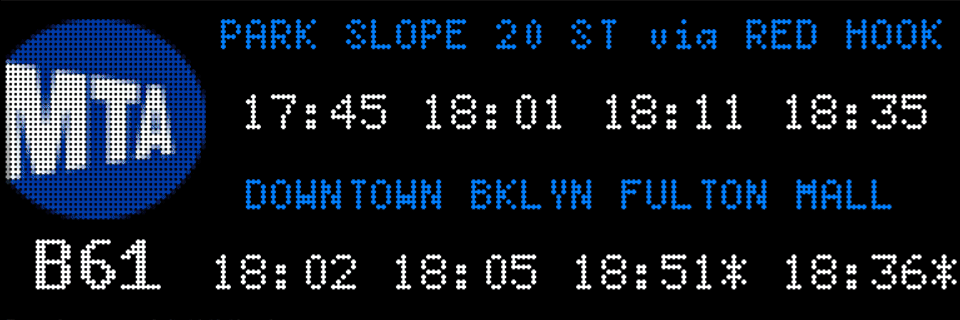
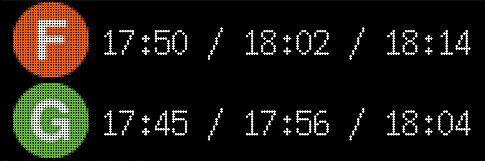
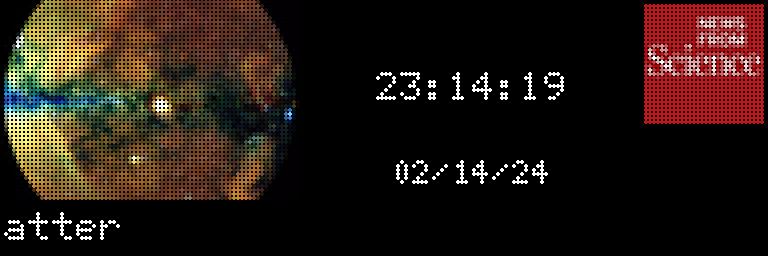
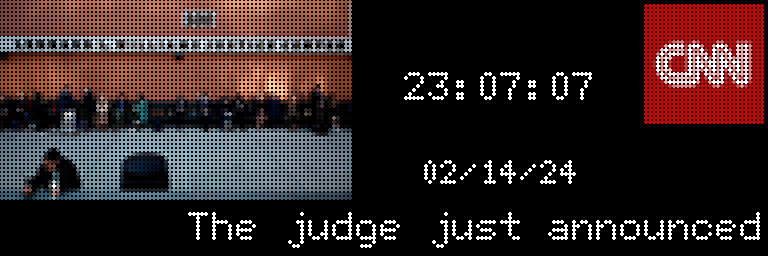

# Commands

## matrix

Displays Picture on Matrix

## mta

Displays next trains and bus arrival time for a given location

## meteo

Displays Weather forcast from wttr.in

## conway

Render Conway's game of life

## scrolltext

Displays Text on Matrix

## citibikes

Displays information about the closest Citibike Station

## news

Displays News from RSS feeds

## time

Displays the current time

## faker

Fake command to test input and output
 

Automatically generated using `python -m Matrix.doc_gen` on 14-02-2024 23:19:55.