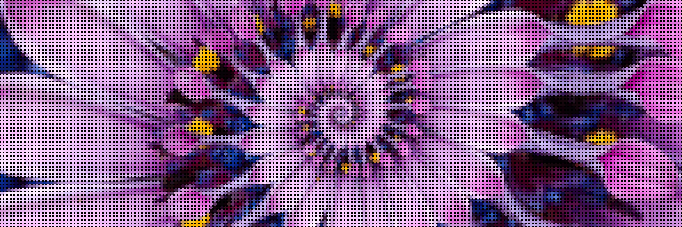
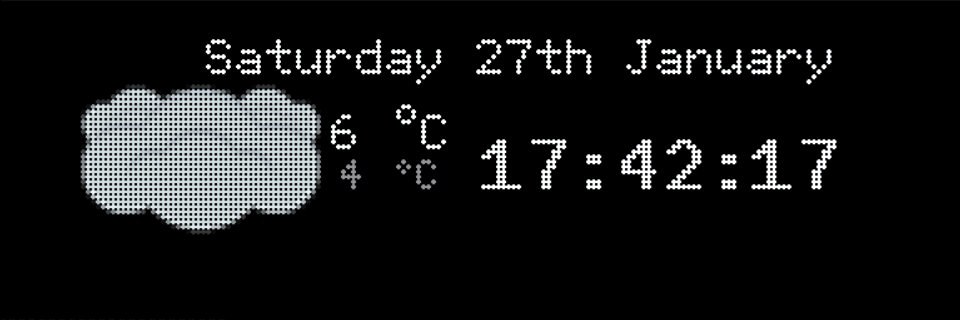
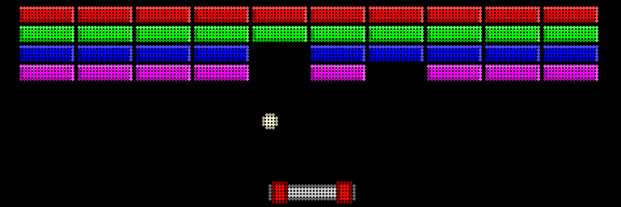
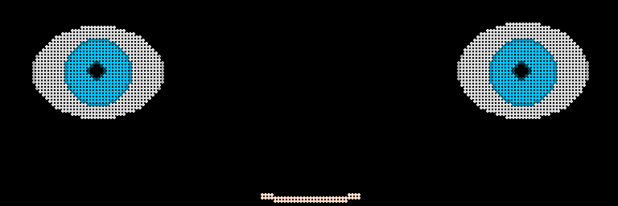
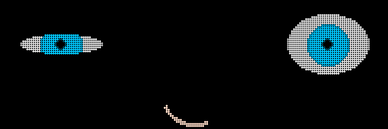
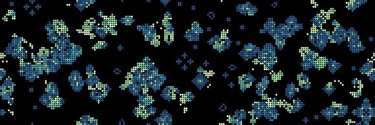
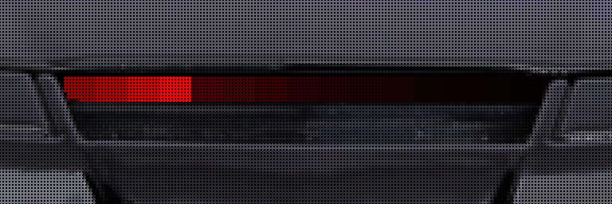

# Commands

## pic

Display an Animated Gif or an Data URI Picture

## mta

Displays next trains and bus arrival time for a given location

More details and configuration, see [mta/ReadMe.md](mta/ReadMe.md)

## meteo

Displays Weather forcast from wttr.in

## splitflap

Display text using Split Flap Display

## arkanoid

Block Breaker game

## eyes

Simple Eyes rendering

## conway

Render Conway's game of life

## scrolltext

Displays Text on Matrix

## splash

Simple Splash Screen

## kitt

K.I.T.T from the K2000 TV series

## spotify

Displays information related to current played song on Spotify

More details and configuration, see [spotify/ReadMe.md](spotify/ReadMe.md)

## citibikes

Displays information about the closest Citibike Station

More details and configuration, see [citibikes/ReadMe.md](citibikes/ReadMe.md)

## news

Displays News from RSS feeds

 

Automatically generated using `python -m Matrix.doc_gen` on 23-03-2024 01:25:23.