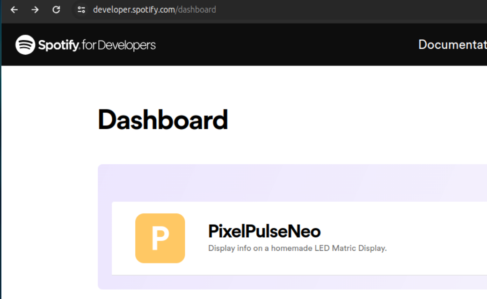

# Using Spotipy API

The Spotify API is accessed via the `spotipy`` python library.

https://spotipy.readthedocs.io/

## API Keys

To Access the Spotify API you need to get API Keys.

You will first need to create an App on the Spotify Developer site: https://developer.spotify.com/documentation/web-api/concepts/apps

The Spotify Command expect to find the 2 following env variables.

    SPOTIPY_CLIENT_ID = ...
    
    SPOTIPY_CLIENT_SECRET = ...

## Authentication Tokens

The Spotify API use OAuth token that require you to grant access to the API for a given scope.

In our case, because we want to have acces to the currently played music we define as scope:

    [
        "user-read-playback-state",
        "user-library-read",
        "user-read-currently-playing",
    ]

The credentials are stored in a file named `.cache` in the root directory (same level as `Matrix`)

The ,cache file contains JSON

    {
        "access_token": "XXX", 
        "token_type": "Bearer", 
        "expires_in": 3600, 
        "scope": "user-library-read user-read-currently-playing user-read-playback-state", 
        "expires_at": 1708057736, 
        "refresh_token": "XXX"
    }

Thanks to the `refresh_token` you should be able to play the auth flow once and then rely on the cache.

Typically, you can generate the `.cache` file from your laptop and simply copy it to the Pi.

To generate the initial authentication, you can run this command line (after activating the python `venv` !):

    python Matrix/driver/commands/spotify/client.py

If the `.cache` file is missing, it should send you on spotify.com to grant access to the API and spotipy will initiate a http server on localhost to intercept the token if you configured your "Spotify App" accordingly.

> If you choose an http-scheme URL, and it’s for localhost or 127.0.0.1, AND it specifies a port, then spotispy will instantiate
> a server on the indicated response to receive the access token from the response at the end of the oauth flow [see the code](https://github.com/plamere/spotipy/blob/master/spotipy/oauth2.py#L483-L490).

