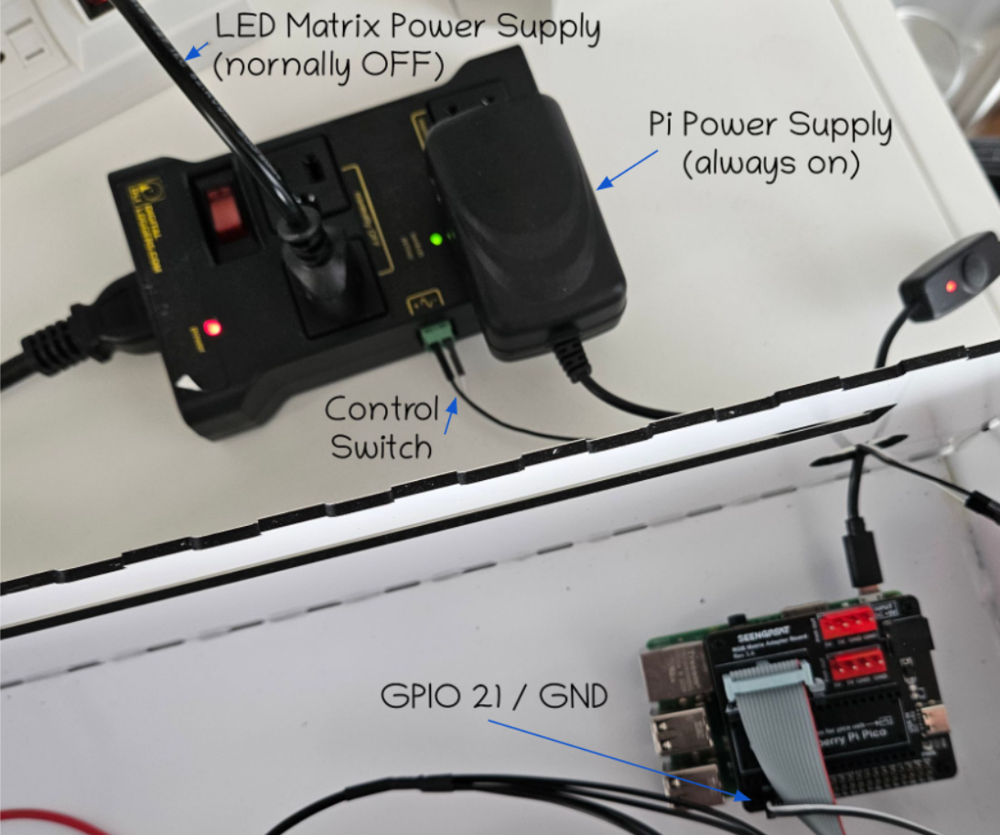

# Power Management

## Why do we need power management?

The system contains 2 sources for power consumption:

 - the LED Panels : draw up to 2 Amp each
 - the PI : can use up to 2 Amp

So, because the system is expected to run 24/7, we want to be able to reduce consumption when possible.

## Sleep mode

The system can be put in sleep mode when the LED Panels are not used, typically during night.

For that, there are 2 actions we want to execute:

 - turn off the LED Matrix Panels
 - slow down the PI to reduce power consumption

We can not completely shut down the PI because there is no simple way (that I know of) to make it start again on a schedule.
 
### PI Sleep mode

To reduce the power consumption of the PI, the sleep mode does 2 things:

 - stop the `scheduler` thread loop that is executing the Matrix Commands
    - this is the source of most CPU and Memory activity
 - switch the ARM processor frequency governor to `powersave`
    - in the case of a RaspberryPi 3B, the frequencey goes from 1400 Mhz to 600 Mhz 

When the PI wake up, we do the reverse:
 - go back to the normal `frequency-governor` (using `cpufrequtils` deb package)
 - re-start the `scheduler` thread loop

### Use the Driver to control a power relay

#### Principles

To power off the LED Matrix Panels power supply, I did not want to do any electronic work, so I rely on the ["IOT Relay]
(https://www.digital-loggers.com/iot2.html) from Digital Loggers.

The [iot relay switch](https://www.digital-loggers.com/iot2.html) is a relay switch that can be controlled via GPIO.

It looks like this:

1 Pin of the PI GPIO port is used to switch on/off the relay.
The IOT switch has 3 types of power plugs:

 - allways on: this is where I plug the PI
 - normally ON: not used
 - normally OFF: used to power on/off the LED Matrix Panels

The choice is to say that unless the software on the PI decides otherwise, the LED Pannels should not get power.
As a result, killing the python process will result in automatically switching off the LED Pannels.

#### Configuration

Use [config.py](Matrix/config.py) to configure how to control the Relay Switch

Define the target GPIO pin used by `gpiozero` to control the [iot relay switch](https://www.digital-loggers.com/iot2.html).

The PIN numbers are defined in the [official RaspberryPi documentation](https://projects.raspberrypi.org/en/projects/physical-computing/1)

    POWER_CONTROL_GPIO_PIN = 21

The [iot relay switch](https://www.digital-loggers.com/iot2.html) has 2 types of controlable POWER outlet:

 - normally ON : ON by default, but can be turned off via GPIO
 - normally OFF: OFF by default, but can be turned on via GPIO

In case you prefer the powwe to be on by default, you can change the switch in the config, but by default, the power is off by default:

    POWER_SWITCH_NORMALY_ON = False

#### Calendar

In the [config.py](Matrix/config.py) file you can define the calendar of when the power should be on/off:

    ONOFF_CALENDDAR = {
            "Monday": ("8:00", "22:00"),
            "Tuesday": ("7:00", "23:00"),
            "Wednesday": ("7:00", "23:00"),
            "Thursday": ("7:00", "23:00"),
            "Friday": ("7:00", "1:00"),
            "Saturday": ("9:00", "02:00"),
            "Sunday": ("10:00", "23:00"),
        }

