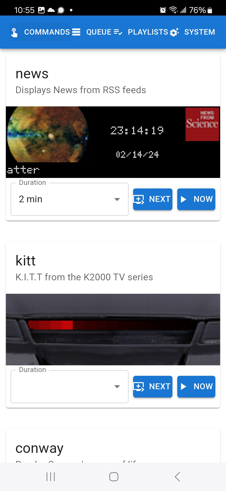
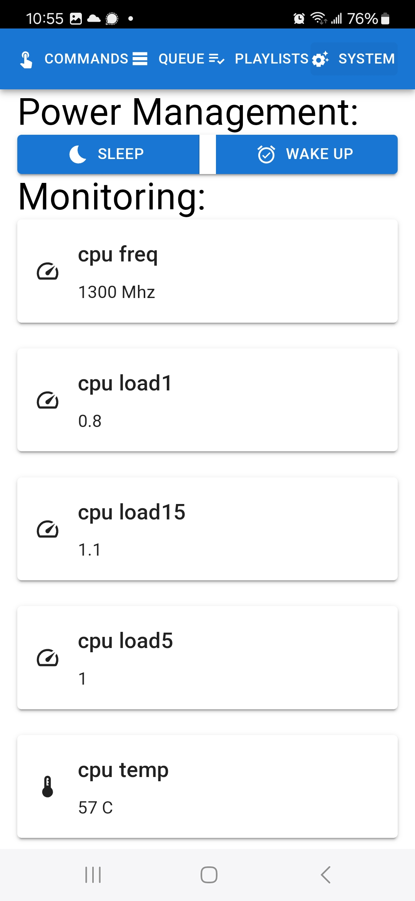
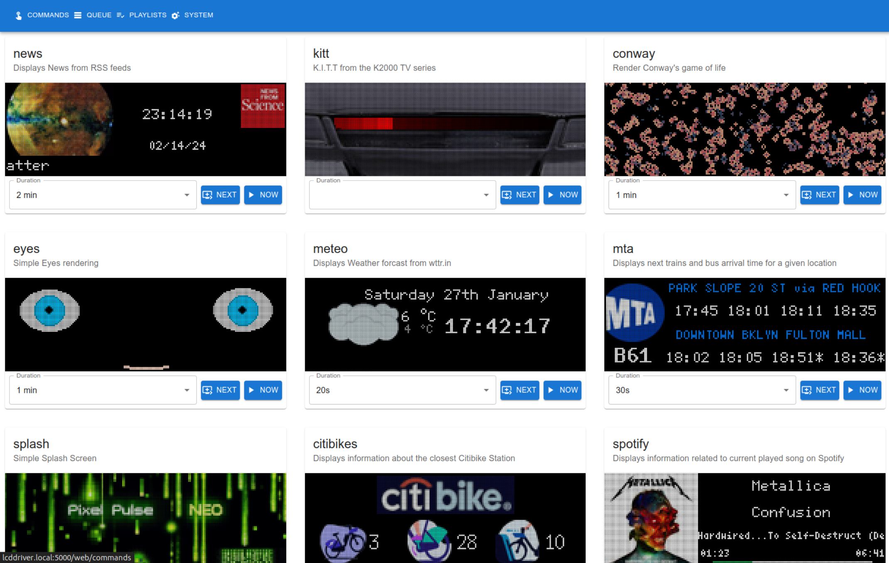
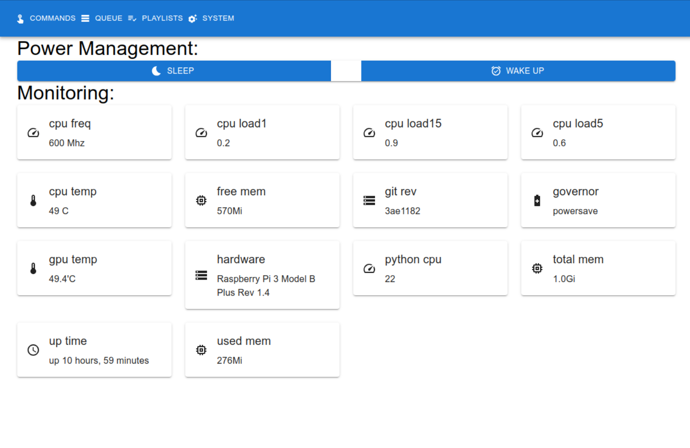

# About 

This project aims at managing display on a set of 64x64 LED Matrix.

The goal is to be able to display information coming from various sources (Weather, Transportation) on a 3x64x64 LED Matrix display from a RaspBerry Pi 3B+.

# Installation

See [Install.md](Install.md) for installation instructions.

# Organization

The project is broken down into multiple parts:

 - the Progressive Web UI in ReactJS
 - the API Server in Python/Flask
 - the Driver written in Python
    - CommandExecutor 
    - IPC remoting Client / Server
    - CLI
 - the power management 

## Driver

### A CommandExecutor for driving the LED Matrix

This is the python program driving the LED Matrix.

The Led Matrix Driver allows to execute commands like:

 - display weather
 - display subway or bus arrival time
 - display news 
 - ...

Depending on the configuration the CommandExecutor can either run the command against a real LED Matrix using [rpi-rgb-led-matrix](https://github.com/hzeller/rpi-rgb-led-matrix) or emulate the display using   [RGBMatrixEmulator](https://github.com/ty-porter/RGBMatrixEmulator).

The default configuration is "Laptop mode" using RGBMatrixEmulator to display via `pygame`.

### Usage

see [Usage.md](Usage.md) for details on how to use the CommandExecutor

    python -m Matrix.driver.executor -c mta -d 200

See  [Matrix.driver](Matrix/driver) for the source and for more details on the internals.

## API Server

The API Server exposes a REST API using Flask.

The APIServer use the driver, either directly or via IPC.

To start the server:

    scripts/api_server.sh

or run from python

    python -m Matrix.api.server

Server by default will run on localhost:5000

Get Swagger-UI from : http://localhost:5000/

The API endpoint is exposed on `http://localhost:5000/api/`

The Web interface is exposed on `http://localhost:5000/web/` (pass-through for the compiled reactjs resources)

See [Matrix.api](Matrix/api/ReadMe.md) for the source and for more details on the internals.

## Mobile Progressive WebApp

The PWA is a Progressive WebApp that can be used from a mobile device.

The PWA is located in [pixel-pulse-neo-client](pixel-pulse-neo-client)

    cd pixel-pulse-neo-client

This is a simple React app that use the API Server to control the display on the LED Matrix.

To build the web app

    npm install

    npm run build

The resulting static files are located in [pixel-pulse-neo-client/build](pixel-pulse-neo-client/build).

These files are served via the API Server on

    http://localhost:5000/web/

To run the web app in debug:

    npm start

For more details see [README.md](pixel-pulse-neo-client/README.md)

<table border=0>    
<tr>
<td>

</td>
<td>

</td>
</tr>
</table>

 
 

# Configuration

Configuration is done via a simple python file [config.py](Matrix/config.py)

Using this file you can configure:

 - how the target **LED Matrix is setup**
    - heigh and width of the LED Matrix
    - number of matrix
 - **Emulation** parameter
    - when you want to test on a laptop
 - **power management** preferences

See [Config.md](Config.md) for more details.

This documentation also explains how **secrets** used by some commands are managed.

## Power Management

Power consumption can be directlty managed from the software and the configuration.

See [Power.md](Power.md) for more details.