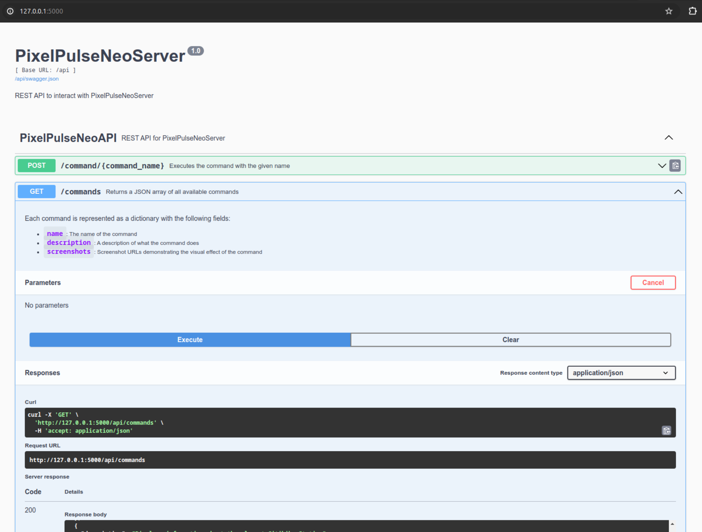

# About 

This project aims at managing display on a set of 64x64 LED Matrix.

The goal is to be able to display information coming from various sources (Weather, Transportation) on a 3x64x64 LED Matrix display from a RaspBerry Pi 3B+.

# Installation

See [Install.md](Install.md) for installation instructions.

# Organization

The project is broken down into multiple parts:

 - the Web UI in ReactJS
 - the API Server in Python/Flask
 - the CommandExecutor in Python

## Driver

### A CommandExecutor for driving the LED Matrix

This is the python program driving the LED Matrix.

The Led Matrix Driver allows to execute commands like:

 - display weather
 - display subway or bus arrival time
 - display news 
 - ...

Depending on the configuration the CommandExecutor can either run the command against a real LED Matrix using [rpi-rgb-led-matrix](https://github.com/hzeller/rpi-rgb-led-matrix) or emulate the display using   [RGBMatrixEmulator](https://github.com/ty-porter/RGBMatrixEmulator).

The default configuration is "Laptop mode" using RGBMatrixEmulator to display via `pygame`.

### Usage

see [Usage.md](Usage.md) for details on how to use the CommandExecutor

    python -m Matrix.driver.executor -c mta -d 200

See  [Matrix.driver](Matrix/driver) for the source and for more details on the internals.

## API Server

The API Server exposes a REST API using Flask.

The APIServer use the driver, either directly or via IPC.

To start the server:

    scripts/api_server.sh

or run from python

    python -m Matrix.api.server

Server by default will run on localhost:5000

Get Swagger-UI from : http://localhost:5000/

The API endpoint is exposed on `http://localhost:5000/api/`

The Web interface is exposed on `http://localhost:5000/web/`

See [Matrix.api](Matrix/api/ReadMe.md) for the source and for more details on the internals.

## Mobile Progressive WebApp

The PWA is a Progressive WebApp that can be used from a mobile device.

The PWA is located in [pixel-pulse-neo-client](pixel-pulse-neo-client)

    cd pixel-pulse-neo-client

This is a simple React app that use the API Server to control the display on the LED Matrix.

To build the web app

    npm install

    npm run build

The resulting static files are located in [pixel-pulse-neo-client/build](pixel-pulse-neo-client/build).

These files are served via the API Server on

    http://localhost:5000/web/

To run the web app in debug:

    npm start

For more details see [README.md](pixel-pulse-neo-client/README.md)

# Configuration

## Driver configuration

Configuration is done via a simple python file [config.py](Matrix/config.py)

**Laptop mode (Enulated LEDMatrix)**

    USE_EMULATOR = True
    USE_IPC = False
    RUN_AS_ROOT = False

**Pi mode (Raspberry Pi + GPIO + LEDMatrix)**

    USE_EMULATOR = False
    USE_IPC = True
    RUN_AS_ROOT = True

NB: All other configurations are for testing purposes

## Configuration of the target LED Matrix 

    # matrix dimentions
    MATRIX_WIDTH = 64
    MATRIX_HEIGHT = 64

    # number of chained matrix
    MATRIX_CHAINED = 3 

    # default refresh rate 
    DEFAULT_REFRESH = 1/60.0

## Emulator configuration

When using the RGBEmulator the configuration is done via the 
[emulator_config.json](emulator_config.json) file.

The default configuration uses `pygame`, but see [RGBMatrixEmulator configuration-options](https://github.com/ty-porter/RGBMatrixEmulator?tab=readme-ov-file#configuration-options) for more options.

## Secrets Management

### Manual run

If you are running this in interactive mode, you can simply populate the environment from your `~/.basshrc` file

    export MTA_API_KEY=XXXX
    export MTA_SIRI_API_KEY=YYYY

    export SPOTIPY_CLIENT_ID=ZZZZZ
    export SPOTIPY_CLIENT_SECRET=XTZ
    export SPOTIPY_REDIRECT_URI=http://127.0.0.1:3099

As documented in  [scripts/ReadMe.nd](scripts/ReadMe.md) as long as you start the scripts using `sudo -E`, this should be good enough.

### SystemD run

If you are using the SystemD packaging to run the service, you need to save the secret in `/etc/PixelPulseNeo/secrets.conf`

You can use [system/ini-config.sh](system/ini-config.sh) to initialize the configuration file from a template.

Then you fill need to edit this file and add the missing entries:

    MTA_API_KEY=
    MTA_SIRI_API_KEY=

    SPOTIPY_CLIENT_ID=
    SPOTIPY_CLIENT_SECRET=
    SPOTIPY_REDIRECT_URI=http://127.0.0.1:3099

## Power Management

Power consumption can be directlty managed from the software and the configuration.

See [Power.md](Power.md) for more details.