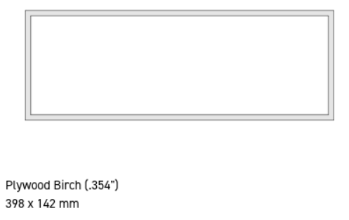

# Building the physical object

## BluePrint : OpenScad Cut Box

This is an OpenSCAD scene for creating boxes to be laser-cut out of flat panels.

It is heavily taken from [lasercut-box-openscad](https://github.com/bullestock/lasercut-box-openscad) and modified to add the holes I needed.

See below what the OpenScad rendering looks like:

## Laser Cut on wood

The OpenScan blueprint was send to [SendCutSend](https://sendcutsend.com/) and cut with a laser cutter on Plywood for the face and hardwood for the others slides.

<table border=0>
<tr>
<td>

</td>
<td>

</td>
</tr>
</table>

## Assembling the LED Matrix

## Matrix connector

I used the [XICOOLEE RGB Matrix Adapter Board](https://www.amazon.com/gp/product/B0BC8Y447G/ref=ox_sc_act_title_6?smid=AXSDPEI0SD5BE&psc=1):

 - it is cheap
 - it foillows the default wiring used in [rpi-rgb-led-matrix](https://github.com/hzeller/rpi-rgb-led-matrix) 

<table border=0>    
<tr>
<td>

</td>
<td>

</td>
</tr>
</table>
